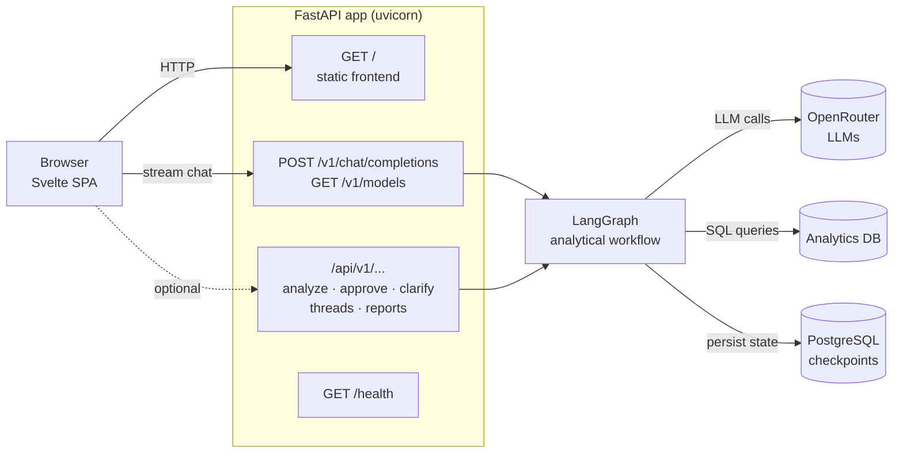
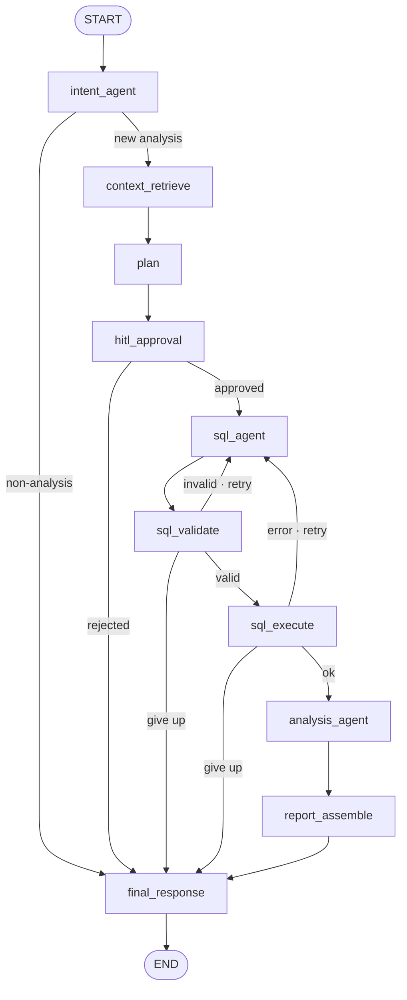

# R2-DB2 — Analytical Agent

Multi-agent analytical system that turns natural language questions into audited, reproducible reports backed by a SQL analytics database. Uses LangGraph for deterministic orchestration and OpenRouter for LLM access.

## Architecture Overview

### System



The Svelte SPA is built into `/app/frontend/dist` and mounted by FastAPI at `/`. User messages stream through the OpenAI-compatible endpoint, which drives the LangGraph workflow below. Postgres stores LangGraph checkpoints; the analytics database holds the data the agent queries; OpenRouter brokers LLM calls.

### LangGraph workflow



`hitl_approval` auto-approves unless `GRAPH__HITL_ENABLED=true`. SQL retries are capped (default 3); on exhaustion the graph falls through to `final_response` with an error.

## Quick Start

```bash
# 1. Clone the repository
git clone <repo-url>
cd r2-db2

# 2. Configure environment
cp .env.example .env
# Edit .env and set your OpenRouter API key:
#   OPENROUTER__API_KEY=sk-or-v1-your-key-here

# 3. Start supporting services + app
docker compose -f docker-compose.dev.yml up --build -d

# The app will be available at http://localhost:8000
# Open WebUI will be available at http://localhost:3000

# 4. Verify it's running
curl http://localhost:8000/health
```

## API Usage

### `POST /api/v1/analyze`
Submit a natural language question.

```bash
curl -X POST http://localhost:8000/api/v1/analyze \
  -H "Content-Type: application/json" \
  -d '{
    "question": "What were total sales by month for the last year?"
  }'
```

```json
{
  "thread_id": "thread_123",
  "status": "running",
  "message": "Plan created and execution started."
}
```

### `POST /api/v1/approve`
Approve or reject a plan (only when HITL is enabled).

```bash
curl -X POST http://localhost:8000/api/v1/approve \
  -H "Content-Type: application/json" \
  -d '{
    "thread_id": "thread_123",
    "approved": true,
    "notes": "Looks good"
  }'
```

```json
{
  "thread_id": "thread_123",
  "approved": true,
  "status": "resumed"
}
```

### `GET /api/v1/threads/{thread_id}/state`
Get the current thread state.

```bash
curl http://localhost:8000/api/v1/threads/thread_123/state
```

```json
{
  "thread_id": "thread_123",
  "intent": "new_analysis",
  "plan_approved": true,
  "sql_retry_count": 0,
  "status": "running"
}
```

### `GET /api/v1/reports/{report_id}`
List all artifacts for a completed report.

```bash
curl http://localhost:8000/api/v1/reports/<report_id>
```

```json
{
  "report_id": "abc-123",
  "artifacts": [
    {"filename": "abc-123.html", "size_bytes": 4800000, "download_url": "/api/v1/reports/abc-123/abc-123.html"},
    {"filename": "abc-123.pdf", "size_bytes": 14750, "download_url": "/api/v1/reports/abc-123/abc-123.pdf"},
    {"filename": "abc-123.csv", "size_bytes": 149, "download_url": "/api/v1/reports/abc-123/abc-123.csv"},
    {"filename": "abc-123.json", "size_bytes": 3700, "download_url": "/api/v1/reports/abc-123/abc-123.json"}
  ]
}
```

### `GET /api/v1/reports/{report_id}/{filename}`
Download a specific report artifact (PDF, HTML, CSV, JSON).

```bash
# Download PDF report
curl -o report.pdf http://localhost:8000/api/v1/reports/<report_id>/<report_id>.pdf
```

### `GET /health`
Health check.

```bash
curl http://localhost:8000/health
```

```json
{
  "status": "ok"
}
```

## Environment Variables

| Variable | Default | Description |
|---|---|---|
| `ENVIRONMENT` | `development` | Runtime environment |
| `DEBUG` | `true` | Enable debug logging |
| `OPENROUTER__API_KEY` | *(required)* | Your OpenRouter API key |
| `OPENROUTER__BASE_URL` | `https://openrouter.ai/api/v1` | OpenRouter API endpoint |
| `OPENROUTER__DEFAULT_MODEL` | `openai/gpt-4o` | Default LLM model |
| `POSTGRES__HOST` | `postgres` | PostgreSQL hostname |
| `POSTGRES__PORT` | `5432` | PostgreSQL port |
| `POSTGRES__USER` | `r2-db2` | PostgreSQL user |
| `POSTGRES__PASSWORD` | `r2_db2_secret` | PostgreSQL password |
| `POSTGRES__DATABASE` | `r2-db2` | PostgreSQL database |
| `REDIS__HOST` | `redis` | Redis hostname |
| `REDIS__PORT` | `6379` | Redis port |
| `QDRANT__HOST` | `qdrant` | Qdrant hostname |
| `QDRANT__PORT` | `6333` | Qdrant port |
| `SERVER__HOST` | `0.0.0.0` | Server bind address |
| `SERVER__PORT` | `8000` | Server port |
| `GRAPH__HITL_ENABLED` | `false` | Enable Human-in-the-Loop approval |
| `LANGFUSE__PUBLIC_KEY` | *(empty)* | Langfuse public key |
| `LANGFUSE__SECRET_KEY` | *(empty)* | Langfuse secret key |
| `LANGFUSE__HOST` | *(empty)* | Langfuse host URL |

See [`.env.example`](.env.example) for analytics database connection settings.

## Docker Services

| Service | Image | Port | Purpose |
|---|---|---|---|
| `app` | Built from Dockerfile | 8000 | FastAPI application |
| `postgres` | postgres:18.3 | 5432 | LangGraph checkpointer |
| `redis` | redis:8-alpine | 6379 | Caching layer |
| `qdrant` | qdrant/qdrant:v1.17.0 | 6333, 6334 | Vector search |
| `openwebui` | ghcr.io/open-webui/open-webui:v0.8.12 | 3000→8080 | Optional chat UI |

## Report Generation & PDF

Reports are generated by [`src/report/service.py`](src/report/service.py:1) using `ReportOutputService`. Each analysis produces artifacts in multiple formats:

| Format | Library | Description |
|---|---|---|
| HTML | Plotly | Interactive charts + data tables |
| PDF | WeasyPrint | Print-ready report (converted from HTML) |
| CSV | stdlib | Raw query result data |
| JSON | stdlib | Structured summary with metadata |

**WeasyPrint System Dependencies:** PDF generation requires system-level libraries installed in the Docker image. These are already configured in the [`Dockerfile`](Dockerfile:1):

```
libpango-1.0-0 libpangoft2-1.0-0 libpangocairo-1.0-0
libgdk-pixbuf-2.0-0 libcairo2 libglib2.0-0 libffi-dev fonts-dejavu-core
```

If PDF generation fails with `OSError: cannot load library 'libgobject-2.0-0'`, these system packages are missing.

## Enabling Human-in-the-Loop (HITL)

HITL is disabled by default. To enable:

```bash
# In .env
GRAPH__HITL_ENABLED=true
```

When enabled, the graph pauses before the approval node. Use `POST /api/v1/approve` to resume.

## Rebuilding Containers

```bash
# Rebuild and restart just the app (after code changes)
docker compose -f docker-compose.dev.yml up --build -d app

# Full rebuild of all services
docker compose -f docker-compose.dev.yml up --build -d

# View logs for a specific service
docker compose -f docker-compose.dev.yml logs -f app

# Check container health status
docker compose -f docker-compose.dev.yml ps
```

## Development (without Docker)

```bash
# Install uv if not already installed
curl -LsSf https://astral.sh/uv/install.sh | sh

# Install dependencies
uv sync

# Start supporting dependencies (Postgres, Redis, Qdrant) via Docker
docker compose -f docker-compose.dev.yml up postgres redis qdrant -d

# Run the app (from src/)
uv run uvicorn main:app --reload --host 0.0.0.0 --port 8000
```

## Project Structure

```
src/
├── graph/           # LangGraph orchestration (state, nodes, builder)
├── integrations/    # Database connectors, chart generation
├── report/          # Report models and output service
├── servers/
│   └── fastapi/     # FastAPI app, routes, graph API routes
├── settings.py      # Configuration
├── errors.py        # Error types
├── _compat.py       # Compatibility layer
└── main.py          # ASGI entrypoint with lifespan
```

Key paths:
- [`src/`](src/:1)
- [`src/graph/`](src/graph/:1)
- [`src/integrations/`](src/integrations/:1)
- [`src/report/`](src/report/:1)
- [`src/servers/`](src/servers/:1)
- [`src/settings.py`](src/settings.py:1)
- [`src/errors.py`](src/errors.py:1)
- [`src/main.py`](src/main.py:1)

## License

This project is licensed under the GNU General Public License v3.0 — see the [`LICENSE`](LICENSE:1) file for the full text.
