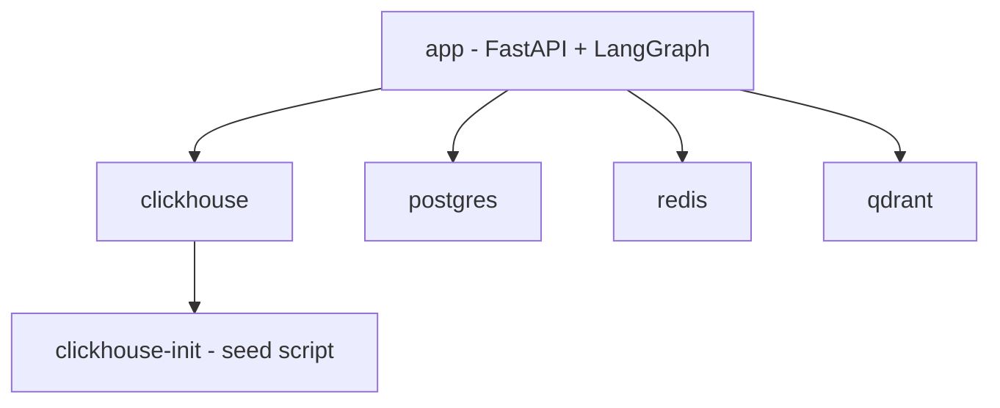
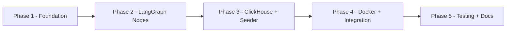

# Implementation Plan: Dockerized R2-DB2 Analytical Agent

> **Scope**: Make the R2-DB2 analytical agent runnable via Docker with OpenRouter LLM, ClickHouse fake data, and a full LangGraph orchestration graph.
> **Reference**: [`docs/final-architecture.md`](final-architecture.md:1) — keep both files in sync as implementation progresses.

---

## 1. Overview

This plan covers five implementation areas:

| Area | Key Deliverables |
|---|---|
| **Docker** | `Dockerfile`, `docker-compose.yml`, `docker-compose.override.yml` |
| **Config** | `src/r2-db2/config/settings.py` (Pydantic Settings), `.env`, `.env.example` |
| **LLM** | OpenRouter adapter wrapping OpenAI-compatible endpoint |
| **ClickHouse** | Enhanced runner + seed script with realistic fake data |
| **LangGraph** | Full `AnalyticalAgentGraph` with all 10 nodes, HITL, checkpointer |

---

## 2. Files to Create / Modify

### 2.1 New Files

```
.env.example                                          # Template env vars
.env                                                  # Local dev (git-ignored)
Dockerfile                                            # Multi-stage Python image
docker-compose.yml                                    # Full stack definition
docker-compose.override.yml                           # Dev overrides (hot-reload)
scripts/seed_clickhouse.py                            # Fake data seeder
src/r2-db2/config/
  __init__.py
  settings.py                                         # Pydantic Settings (env-config pattern)
src/r2-db2/integrations/openrouter/
  __init__.py
  llm_router.py                                       # OpenRouter LLM adapter
src/r2-db2/integrations/clickhouse/
  schema.py                                           # Table DDL + schema metadata
  seeder.py                                           # Fake data generation + insertion
src/r2-db2/graph/
  __init__.py
  state.py                                            # AnalyticalAgentState TypedDict
  nodes/
    __init__.py
    intent_classify.py
    context_retrieve.py
    plan.py
    hitl_approval.py
    sql_generate.py
    sql_execute.py
    analysis_sandbox.py
    report_assemble.py
    memory_update.py
    final_response.py
  edges.py                                            # Routing functions
  graph.py                                            # StateGraph assembly + compile
src/r2-db2/servers/fastapi/
  lifespan.py                                         # Startup/shutdown (DB init, seeding)
  graph_routes.py                                     # /graph/invoke, /graph/stream endpoints
```

### 2.2 Modified Files

| File | Change |
|---|---|
| [`pyproject.toml`](../pyproject.toml:1) | Add `pydantic-settings`, `openai`, `faker`, `langgraph-checkpoint-postgres` (already present), `python-dotenv` |
| [`src/r2-db2/integrations/clickhouse/sql_runner.py`](../src/r2-db2/integrations/clickhouse/sql_runner.py:1) | Add `validate()`, `explain()`, `execute()` methods matching `SQLRunner` Protocol; add async connection pool |
| [`src/r2-db2/servers/fastapi/app.py`](../src/r2-db2/servers/fastapi/app.py:1) | Wire `lifespan` context manager; register `graph_routes` |

---

## 3. Docker Services

### 3.1 Service Map



### 3.2 `docker-compose.yml` Services

| Service | Image | Ports | Purpose |
|---|---|---|---|
| `app` | `./Dockerfile` | `8000:8000` | FastAPI server + LangGraph worker |
| `clickhouse` | `clickhouse/clickhouse-server:24` | `8123:8123`, `9000:9000` | Analytical data warehouse |
| `clickhouse-init` | `./Dockerfile` | — | One-shot seed container (depends_on clickhouse) |
| `postgres` | `postgres:16-alpine` | `5432:5432` | LangGraph checkpoints + audit + eval results |
| `redis` | `redis:7-alpine` | `6379:6379` | Query cache + schema cache |
| `qdrant` | `qdrant/qdrant:v1.9` | `6333:6333` | Schema + historical query semantic retrieval |

### 3.3 `Dockerfile` (Multi-Stage)

```
Stage 1: builder
  - python:3.13-slim
  - Install uv
  - Copy pyproject.toml + uv.lock
  - uv sync --frozen --no-dev

Stage 2: runtime
  - python:3.13-slim
  - Copy venv from builder
  - Copy src/
  - EXPOSE 8000
  - CMD ["uvicorn", "r2-db2.servers.fastapi.main:app", "--host", "0.0.0.0", "--port", "8000"]
```

### 3.4 Volume Mounts

| Volume | Purpose |
|---|---|
| `clickhouse_data` | Persist ClickHouse tables across restarts |
| `postgres_data` | Persist LangGraph checkpoints |
| `redis_data` | Optional: persist Redis AOF |
| `qdrant_data` | Persist Qdrant collections |
| `./artifacts` | Report outputs (PDF, HTML, Parquet) mounted into app |

---

## 4. Environment Variables Structure

### 4.1 Pydantic Settings Design

Following the **env-config skill** pattern with `SettingsConfigDict(env_nested_delimiter='__')`:

```python
# src/r2-db2/config/settings.py

from pydantic import Field
from pydantic_settings import BaseSettings, SettingsConfigDict

class OpenRouterSettings(BaseSettings):
    api_key: str
    base_url: str = "https://openrouter.ai/api/v1"
    default_model: str = "anthropic/claude-3-5-sonnet"
    fallback_model: str = "openai/gpt-4o-mini"
    max_tokens: int = 4096
    temperature: float = 0.1

class ClickHouseSettings(BaseSettings):
    host: str = "clickhouse"
    port: int = 8123
    database: str = "analytics"
    user: str = "default"
    password: str = ""
    seed_on_startup: bool = True

class PostgresSettings(BaseSettings):
    host: str = "postgres"
    port: int = 5432
    database: str = "r2-db2"
    user: str = "r2-db2"
    password: str = "r2-db2"

    @property
    def dsn(self) -> str:
        return f"postgresql://{self.user}:{self.password}@{self.host}:{self.port}/{self.database}"

class RedisSettings(BaseSettings):
    host: str = "redis"
    port: int = 6379
    db: int = 0
    ttl_seconds: int = 3600

class QdrantSettings(BaseSettings):
    host: str = "qdrant"
    port: int = 6333
    collection_schema: str = "schema_context"
    collection_queries: str = "historical_queries"

class Settings(BaseSettings):
    model_config = SettingsConfigDict(
        env_nested_delimiter="__",
        env_file=".env",
        env_file_encoding="utf-8",
        extra="ignore",
    )

    environment: str = "development"
    debug: bool = False
    log_level: str = "INFO"

    openrouter: OpenRouterSettings = Field(default_factory=OpenRouterSettings)
    clickhouse: ClickHouseSettings = Field(default_factory=ClickHouseSettings)
    postgres: PostgresSettings = Field(default_factory=PostgresSettings)
    redis: RedisSettings = Field(default_factory=RedisSettings)
    qdrant: QdrantSettings = Field(default_factory=QdrantSettings)

    # LangGraph
    langgraph_checkpointer: str = "postgres"   # "memory" | "postgres"
    max_sql_retries: int = 2
    max_sandbox_retries: int = 1
    max_followup_queries: int = 3

    # Security
    secret_key: str = "change-me-in-production"
    allowed_tables: list[str] = Field(default_factory=list)  # empty = all allowed
    sql_row_limit: int = 10000

    # Observability
    langfuse_public_key: str | None = None
    langfuse_secret_key: str | None = None
    langfuse_host: str = "https://cloud.langfuse.com"
```

### 4.2 `.env.example`

```bash
# ── Application ──────────────────────────────────────────────────────────────
ENVIRONMENT=development
DEBUG=false
LOG_LEVEL=INFO
SECRET_KEY=change-me-in-production

# ── OpenRouter LLM ───────────────────────────────────────────────────────────
OPENROUTER__API_KEY=sk-or-v1-...
OPENROUTER__BASE_URL=https://openrouter.ai/api/v1
OPENROUTER__DEFAULT_MODEL=anthropic/claude-3-5-sonnet
OPENROUTER__FALLBACK_MODEL=openai/gpt-4o-mini
OPENROUTER__MAX_TOKENS=4096
OPENROUTER__TEMPERATURE=0.1

# ── ClickHouse ───────────────────────────────────────────────────────────────
CLICKHOUSE__HOST=clickhouse
CLICKHOUSE__PORT=8123
CLICKHOUSE__DATABASE=analytics
CLICKHOUSE__USER=default
CLICKHOUSE__PASSWORD=
CLICKHOUSE__SEED_ON_STARTUP=true

# ── PostgreSQL (LangGraph checkpoints) ───────────────────────────────────────
POSTGRES__HOST=postgres
POSTGRES__PORT=5432
POSTGRES__DATABASE=r2-db2
POSTGRES__USER=r2-db2
POSTGRES__PASSWORD=r2-db2

# ── Redis (cache) ────────────────────────────────────────────────────────────
REDIS__HOST=redis
REDIS__PORT=6379
REDIS__DB=0
REDIS__TTL_SECONDS=3600

# ── Qdrant (semantic retrieval) ──────────────────────────────────────────────
QDRANT__HOST=qdrant
QDRANT__PORT=6333
QDRANT__COLLECTION_SCHEMA=schema_context
QDRANT__COLLECTION_QUERIES=historical_queries

# ── LangGraph ────────────────────────────────────────────────────────────────
LANGGRAPH_CHECKPOINTER=postgres
MAX_SQL_RETRIES=2
MAX_SANDBOX_RETRIES=1
MAX_FOLLOWUP_QUERIES=3

# ── Security ─────────────────────────────────────────────────────────────────
# Comma-separated table allowlist (empty = all tables allowed)
ALLOWED_TABLES=
SQL_ROW_LIMIT=10000

# ── Observability (optional) ─────────────────────────────────────────────────
LANGFUSE_PUBLIC_KEY=
LANGFUSE_SECRET_KEY=
LANGFUSE_HOST=https://cloud.langfuse.com
```

---

## 5. ClickHouse Fake Data Schema

### 5.1 Tables

Three tables model a realistic e-commerce analytics dataset:

#### `orders`
```sql
CREATE TABLE analytics.orders (
    order_id        UUID            DEFAULT generateUUIDv4(),
    customer_id     UInt64,
    product_id      UInt64,
    category        LowCardinality(String),
    region          LowCardinality(String),
    order_date      DateTime,
    quantity        UInt16,
    unit_price      Decimal(10, 2),
    total_amount    Decimal(12, 2),
    status          LowCardinality(String),   -- pending, shipped, delivered, cancelled
    payment_method  LowCardinality(String)    -- card, paypal, bank_transfer
) ENGINE = MergeTree()
ORDER BY (order_date, customer_id)
PARTITION BY toYYYYMM(order_date);
```

#### `customers`
```sql
CREATE TABLE analytics.customers (
    customer_id     UInt64,
    name            String,
    email           String,
    country         LowCardinality(String),
    city            String,
    signup_date     Date,
    tier            LowCardinality(String),   -- bronze, silver, gold, platinum
    lifetime_value  Decimal(12, 2)
) ENGINE = MergeTree()
ORDER BY customer_id;
```

#### `events`
```sql
CREATE TABLE analytics.events (
    event_id        UUID            DEFAULT generateUUIDv4(),
    customer_id     UInt64,
    session_id      String,
    event_type      LowCardinality(String),   -- page_view, add_to_cart, purchase, search
    page            String,
    event_time      DateTime,
    device          LowCardinality(String),   -- desktop, mobile, tablet
    country         LowCardinality(String)
) ENGINE = MergeTree()
ORDER BY (event_time, customer_id)
PARTITION BY toYYYYMM(event_time);
```

### 5.2 Seeding Strategy

**File**: [`scripts/seed_clickhouse.py`](../scripts/seed_clickhouse.py)

```
1. Connect to ClickHouse using settings
2. CREATE DATABASE IF NOT EXISTS analytics
3. CREATE TABLE IF NOT EXISTS for each table (idempotent DDL)
4. Check row count — skip if already seeded (idempotent)
5. Generate fake data using Faker + random:
   - 500 customers (realistic names, emails, countries)
   - 50,000 orders spanning 2 years (seasonal patterns)
   - 200,000 events (funnel: views → cart → purchase)
6. Batch insert in chunks of 5,000 rows
7. Log row counts on completion
```

**Seeder is invoked**:
- By the `clickhouse-init` Docker service (one-shot)
- OR on app startup if `CLICKHOUSE__SEED_ON_STARTUP=true` via the FastAPI lifespan

### 5.3 Analytical Patterns in Fake Data

The fake data is designed to support realistic analytical queries:

| Pattern | Implementation |
|---|---|
| Seasonal trends | Orders peak in Nov–Dec (holiday season) |
| Regional variation | 5 regions with different product preferences |
| Customer tiers | Platinum customers have 10× higher LTV |
| Funnel drop-off | ~3% of page views convert to purchase |
| Anomalies | 2 months with artificially high cancellation rates |

---

## 6. LangGraph Orchestration Graph

### 6.1 State Definition

**File**: [`src/r2-db2/graph/state.py`](../src/r2-db2/graph/state.py)

The `AnalyticalAgentState` TypedDict from [`AGENTS.md`](../AGENTS.md:1) is used verbatim, with one addition for retry tracking:

```python
from typing import TypedDict, Literal, Any, Annotated
import operator

class AnalyticalAgentState(TypedDict):
    # Conversation
    conversation_id: str
    user_id: str
    messages: Annotated[list[dict[str, Any]], operator.add]  # append-only

    # Intent + Planning
    intent: Literal["new_analysis", "follow_up", "clarification", "off_topic"] | None
    plan: dict[str, Any] | None
    plan_approved: bool

    # Context
    schema_context: list[dict[str, Any]]
    historical_queries: list[dict[str, Any]]

    # SQL
    generated_sql: str | None
    sql_validation_errors: list[str]
    sql_retry_count: int

    # Execution
    query_result: dict[str, Any] | None   # includes parquet_path
    execution_time_ms: int | None

    # Analysis
    analysis_artifacts: list[dict[str, Any]]
    sandbox_id: str | None

    # Multi-query expansion
    followup_candidates: list[dict[str, Any]]
    approved_followups: list[dict[str, Any]]
    followup_loop_count: int              # NEW: bounds the expansion loop

    # Output
    report: dict[str, Any] | None
    output_formats: list[Literal["pdf", "plotly_html", "csv", "parquet", "json"]]

    # Metadata
    total_llm_tokens: int
    estimated_cost_usd: float
    trace_id: str
    error: str | None                     # NEW: structured error for final_response
```

### 6.2 Node Signatures

Each node is a pure async function `async def node_name(state: AnalyticalAgentState) -> dict`.

| Node | File | LLM | Key Inputs | Key Outputs |
|---|---|---|---|---|
| `intent_classify` | `nodes/intent_classify.py` | Yes | `messages` | `intent` |
| `context_retrieve` | `nodes/context_retrieve.py` | Optional | `intent`, `messages` | `schema_context`, `historical_queries` |
| `plan` | `nodes/plan.py` | Yes | `messages`, `schema_context` | `plan`, `estimated_cost_usd` |
| `hitl_approval` | `nodes/hitl_approval.py` | No | `plan` or `followup_candidates` | `plan_approved`, `approved_followups` |
| `sql_generate` | `nodes/sql_generate.py` | Yes | `plan`, `schema_context`, `historical_queries` | `generated_sql`, `sql_validation_errors` |
| `sql_execute` | `nodes/sql_execute.py` | No | `generated_sql` | `query_result`, `execution_time_ms` |
| `analysis_sandbox` | `nodes/analysis_sandbox.py` | Yes | `query_result`, `plan` | `analysis_artifacts`, `followup_candidates` |
| `report_assemble` | `nodes/report_assemble.py` | Yes | `analysis_artifacts`, `plan` | `report` |
| `memory_update` | `nodes/memory_update.py` | No | `messages`, `generated_sql`, `query_result` | `messages` (appended) |
| `final_response` | `nodes/final_response.py` | No | `report` or `error` | `messages` (appended) |

### 6.3 Graph Structure

**File**: [`src/r2-db2/graph/graph.py`](../src/r2-db2/graph/graph.py)

```python
from langgraph.graph import StateGraph, START, END
from langgraph.checkpoint.memory import MemorySaver
from langgraph.checkpoint.postgres import PostgresSaver

def build_graph(settings: Settings) -> CompiledGraph:
    builder = StateGraph(AnalyticalAgentState)

    # Register nodes
    builder.add_node("intent_classify",   intent_classify_node)
    builder.add_node("context_retrieve",  context_retrieve_node)
    builder.add_node("plan",              plan_node)
    builder.add_node("hitl_approval",     hitl_approval_node)   # uses interrupt()
    builder.add_node("sql_generate",      sql_generate_node)
    builder.add_node("sql_execute",       sql_execute_node)
    builder.add_node("analysis_sandbox",  analysis_sandbox_node)
    builder.add_node("report_assemble",   report_assemble_node)
    builder.add_node("memory_update",     memory_update_node)
    builder.add_node("final_response",    final_response_node)

    # Primary flow
    builder.add_edge(START,              "intent_classify")
    builder.add_edge("intent_classify",  "context_retrieve")
    builder.add_edge("context_retrieve", "plan")
    builder.add_edge("plan",             "hitl_approval")

    # Post-HITL routing
    builder.add_conditional_edges(
        "hitl_approval",
        route_after_hitl,
        {
            "sql_generate":   "sql_generate",
            "final_response": "final_response",   # plan rejected
        }
    )

    # SQL retry loop
    builder.add_conditional_edges(
        "sql_execute",
        route_after_sql_execute,
        {
            "analysis_sandbox": "analysis_sandbox",
            "sql_generate":     "sql_generate",   # retry with error context
            "final_response":   "final_response", # max retries exceeded
        }
    )

    # Analysis → follow-up expansion loop
    builder.add_conditional_edges(
        "analysis_sandbox",
        route_after_analysis,
        {
            "hitl_approval":  "hitl_approval",    # propose follow-ups
            "report_assemble": "report_assemble", # no follow-ups or max reached
        }
    )

    # Terminal flow
    builder.add_edge("report_assemble", "memory_update")
    builder.add_edge("memory_update",   "final_response")
    builder.add_edge("final_response",  END)

    # Checkpointer selection
    if settings.langgraph_checkpointer == "postgres":
        checkpointer = PostgresSaver.from_conn_string(settings.postgres.dsn)
    else:
        checkpointer = MemorySaver()

    return builder.compile(
        checkpointer=checkpointer,
        interrupt_before=["hitl_approval"],   # pause for human input
    )
```

### 6.4 Routing Functions

**File**: [`src/r2-db2/graph/edges.py`](../src/r2-db2/graph/edges.py)

```python
def route_after_hitl(state: AnalyticalAgentState) -> str:
    if state["plan_approved"]:
        return "sql_generate"
    return "final_response"

def route_after_sql_execute(state: AnalyticalAgentState) -> str:
    if state["query_result"] is not None:
        return "analysis_sandbox"
    if state["sql_retry_count"] < settings.max_sql_retries:
        return "sql_generate"
    return "final_response"

def route_after_analysis(state: AnalyticalAgentState) -> str:
    has_followups = bool(state.get("followup_candidates"))
    loop_limit_reached = state.get("followup_loop_count", 0) >= settings.max_followup_queries
    if has_followups and not loop_limit_reached:
        return "hitl_approval"
    return "report_assemble"
```

### 6.5 HITL Approval Node

Uses `langgraph.types.interrupt` to pause execution and wait for human input:

```python
from langgraph.types import interrupt

async def hitl_approval_node(state: AnalyticalAgentState) -> dict:
    # Determine what we're approving: plan or follow-up queries
    if state.get("followup_candidates"):
        payload = {
            "type": "followup_approval",
            "candidates": state["followup_candidates"],
            "estimated_cost_usd": state["estimated_cost_usd"],
        }
    else:
        payload = {
            "type": "plan_approval",
            "plan": state["plan"],
            "estimated_cost_usd": state["estimated_cost_usd"],
        }

    decision = interrupt(payload)   # Execution pauses here

    if isinstance(decision, dict) and decision.get("approved"):
        return {
            "plan_approved": True,
            "approved_followups": decision.get("selected_followups", []),
            "followup_loop_count": state.get("followup_loop_count", 0) + 1,
        }
    return {"plan_approved": False}
```

**Resume pattern** (called from API endpoint):
```python
from langgraph.types import Command

graph.invoke(
    Command(resume={"approved": True, "selected_followups": [...]}),
    config={"configurable": {"thread_id": conversation_id}}
)
```

### 6.6 OpenRouter LLM Adapter

**File**: [`src/r2-db2/integrations/openrouter/llm_router.py`](../src/r2-db2/integrations/openrouter/llm_router.py)

Uses `langchain_openai.ChatOpenAI` pointed at the OpenRouter base URL — no custom HTTP client needed:

```python
from langchain_openai import ChatOpenAI
from langchain_core.messages import BaseMessage

class OpenRouterLLM:
    def __init__(self, settings: OpenRouterSettings):
        self._primary = ChatOpenAI(
            model=settings.default_model,
            api_key=settings.api_key,
            base_url=settings.base_url,
            max_tokens=settings.max_tokens,
            temperature=settings.temperature,
        )
        self._fallback = ChatOpenAI(
            model=settings.fallback_model,
            api_key=settings.api_key,
            base_url=settings.base_url,
            max_tokens=settings.max_tokens,
            temperature=settings.temperature,
        )

    async def ainvoke(self, messages: list[BaseMessage], **kwargs) -> BaseMessage:
        try:
            return await self._primary.ainvoke(messages, **kwargs)
        except Exception:
            return await self._fallback.ainvoke(messages, **kwargs)

    def with_structured_output(self, schema):
        return self._primary.with_structured_output(schema)
```

---

## 7. Dependency Additions to `pyproject.toml`

### 7.1 Core Dependencies to Add

```toml
[project]
dependencies = [
    # ... existing ...
    "pydantic-settings>=2.3.0",      # Pydantic Settings with env_nested_delimiter
    "openai>=1.30.0",                # OpenAI-compatible client (used by langchain_openai)
    "langchain-openai>=0.1.0",       # ChatOpenAI for OpenRouter
    "faker>=25.0.0",                 # Fake data generation for ClickHouse seeder
    "python-dotenv>=1.0.0",          # .env file loading
    "pyarrow>=16.0.0",               # Parquet output format
    "weasyprint>=62.0",              # PDF report generation
    "psycopg[binary]>=3.1.0",        # Async Postgres driver (psycopg3 for langgraph-checkpoint-postgres)
]
```

### 7.2 Optional Dependencies to Add

```toml
[project.optional-dependencies]
dev = [
    "pytest-asyncio>=0.23.0",
    "httpx>=0.27.0",
    "pytest>=8.0.0",
]
```

### 7.3 Already Present (Verify Versions)

| Package | Current | Notes |
|---|---|---|
| `langgraph>=1.0.9` | ✅ | Sufficient |
| `langgraph-checkpoint-postgres>=3.0.4` | ✅ | Sufficient |
| `langgraph-checkpoint-redis>=0.3.5` | ✅ | Sufficient |
| `smolagents[e2b]>=1.24.0` | ✅ | Sandbox support |
| `langfuse>=3.14.5` | ✅ | Observability |
| `clickhouse_connect` | ✅ (optional) | Move to core deps |
| `pydantic>=2.12.5` | ✅ | Sufficient |

---

## 8. FastAPI Integration

### 8.1 Lifespan Context Manager

**File**: [`src/r2-db2/servers/fastapi/lifespan.py`](../src/r2-db2/servers/fastapi/lifespan.py)

```python
from contextlib import asynccontextmanager
from fastapi import FastAPI

@asynccontextmanager
async def lifespan(app: FastAPI):
    settings = get_settings()

    # 1. Initialize Postgres schema for LangGraph checkpointer
    await init_postgres_schema(settings.postgres)

    # 2. Seed ClickHouse if enabled
    if settings.clickhouse.seed_on_startup:
        await seed_clickhouse_if_empty(settings.clickhouse)

    # 3. Index schema into Qdrant (if collection empty)
    await index_schema_if_empty(settings.qdrant, settings.clickhouse)

    # 4. Build and attach LangGraph
    app.state.graph = build_graph(settings)
    app.state.settings = settings

    yield

    # Shutdown: close connection pools
    await cleanup_connections()
```

### 8.2 Graph API Endpoints

**File**: [`src/r2-db2/servers/fastapi/graph_routes.py`](../src/r2-db2/servers/fastapi/graph_routes.py)

```
POST /api/v1/graph/invoke
  Body: { conversation_id, user_id, message }
  Returns: { state, interrupt_payload? }

POST /api/v1/graph/resume
  Body: { conversation_id, decision: { approved, selected_followups? } }
  Returns: { state }

GET  /api/v1/graph/stream/{conversation_id}
  SSE stream of state updates

GET  /api/v1/graph/state/{conversation_id}
  Returns current checkpoint state
```

---

## 9. Execution Order for Implementation



### Phase 1 — Foundation (Config + Docker skeleton)

1. Add `pydantic-settings`, `openai`, `langchain-openai`, `faker`, `pyarrow` to [`pyproject.toml`](../pyproject.toml:1)
2. Create [`src/r2-db2/config/settings.py`](../src/r2-db2/config/settings.py) — full `Settings` class
3. Create [`.env.example`](../.env.example) with all variables documented
4. Create [`.env`](../.env) for local dev (copy from `.env.example`, fill in `OPENROUTER__API_KEY`)
5. Create [`Dockerfile`](../Dockerfile) — multi-stage build
6. Create [`docker-compose.yml`](../docker-compose.yml) — all 6 services
7. Create [`docker-compose.override.yml`](../docker-compose.override.yml) — dev hot-reload

### Phase 2 — LangGraph Graph

8. Create [`src/r2-db2/graph/state.py`](../src/r2-db2/graph/state.py) — `AnalyticalAgentState`
9. Create [`src/r2-db2/integrations/openrouter/llm_router.py`](../src/r2-db2/integrations/openrouter/llm_router.py)
10. Create stub implementations for all 10 node files in [`src/r2-db2/graph/nodes/`](../src/r2-db2/graph/nodes/)
11. Create [`src/r2-db2/graph/edges.py`](../src/r2-db2/graph/edges.py) — routing functions
12. Create [`src/r2-db2/graph/graph.py`](../src/r2-db2/graph/graph.py) — `build_graph()` with checkpointer
13. Implement `hitl_approval` node with `interrupt()` / `Command(resume=...)` pattern
14. Implement `intent_classify` node (structured output → `intent` field)
15. Implement `sql_generate` node (structured output → SQL string)
16. Implement `sql_execute` node (calls enhanced ClickHouse runner)
17. Implement remaining nodes: `context_retrieve`, `plan`, `analysis_sandbox`, `report_assemble`, `memory_update`, `final_response`

### Phase 3 — ClickHouse + Seeder

18. Create [`src/r2-db2/integrations/clickhouse/schema.py`](../src/r2-db2/integrations/clickhouse/schema.py) — DDL strings + schema metadata dicts
19. Create [`src/r2-db2/integrations/clickhouse/seeder.py`](../src/r2-db2/integrations/clickhouse/seeder.py) — Faker-based data generation
20. Create [`scripts/seed_clickhouse.py`](../scripts/seed_clickhouse.py) — CLI entry point for seeder
21. Enhance [`src/r2-db2/integrations/clickhouse/sql_runner.py`](../src/r2-db2/integrations/clickhouse/sql_runner.py) — add `validate()`, `explain()`, `execute()` matching Protocol; add read-only guard; add LIMIT enforcement

### Phase 4 — FastAPI Integration + Docker

22. Create [`src/r2-db2/servers/fastapi/lifespan.py`](../src/r2-db2/servers/fastapi/lifespan.py)
23. Create [`src/r2-db2/servers/fastapi/graph_routes.py`](../src/r2-db2/servers/fastapi/graph_routes.py)
24. Modify [`src/r2-db2/servers/fastapi/app.py`](../src/r2-db2/servers/fastapi/app.py:29) — wire lifespan + graph routes
25. End-to-end test: `docker compose up` → seed → invoke graph → HITL → report

### Phase 5 — Tests + Documentation

26. Write pytest unit tests for each graph node (mock LLM + ClickHouse)
27. Write integration test: full pipeline with `MemorySaver` checkpointer
28. Update [`docs/final-architecture.md`](final-architecture.md:1) to reflect any deviations
29. Add `README.md` quickstart section: `cp .env.example .env && docker compose up`

---

## 10. Security Checklist

| Control | Implementation Location |
|---|---|
| Read-only SQL enforcement | `sql_runner.py` — reject DDL/DML keywords before execution |
| LIMIT guard | `sql_runner.py` — append `LIMIT {SQL_ROW_LIMIT}` if not present |
| Table allowlist | `sql_generate.py` — validate generated SQL against `settings.allowed_tables` |
| No credentials in sandbox | `analysis_sandbox.py` — pass only parquet path, no DB creds |
| Secret key rotation | `settings.py` — `SECRET_KEY` required, no default in prod |

---

## 11. Observability Hooks

Each node emits a Langfuse span using the `trace_id` from state:

```python
# Pattern used in every node
from langfuse import Langfuse

langfuse = Langfuse()

async def intent_classify_node(state: AnalyticalAgentState) -> dict:
    span = langfuse.span(
        trace_id=state["trace_id"],
        name="intent_classify",
        input={"messages": state["messages"][-3:]},
    )
    # ... node logic ...
    span.end(output={"intent": intent})
    return {"intent": intent}
```

---

## 12. Key Design Decisions

| Decision | Rationale |
|---|---|
| OpenRouter via `langchain_openai.ChatOpenAI` | Zero custom HTTP code; OpenRouter is OpenAI-compatible; fallback model handled in adapter |
| `interrupt_before=["hitl_approval"]` | Single interrupt point covers both plan approval and follow-up approval; simpler than two interrupt nodes |
| `followup_loop_count` in state | Bounds the multi-query expansion loop without external counter |
| `clickhouse-init` as separate Docker service | Keeps seeding idempotent and separate from app startup; app can also seed via lifespan for non-Docker use |
| `PostgresSaver` for checkpointer | Survives container restarts; `MemorySaver` available for unit tests via `LANGGRAPH_CHECKPOINTER=memory` |
| `Annotated[list, operator.add]` for `messages` | LangGraph reducer pattern — safe concurrent appends without overwrite |
| `pydantic-settings` with `env_nested_delimiter='__'` | Follows env-config skill pattern; clean separation of service configs; Docker env vars map directly |

---

*This plan was generated from analysis of the existing codebase at [`src/r2-db2/`](../src/r2-db2/) and the architecture specification at [`docs/final-architecture.md`](final-architecture.md:1). Update both documents when implementation deviates from this plan.*
