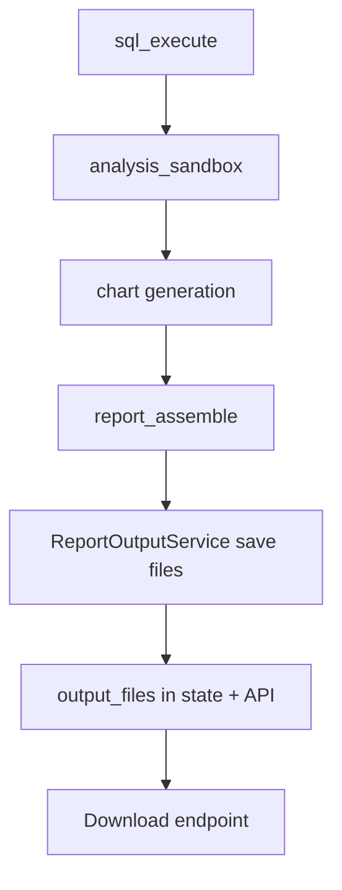
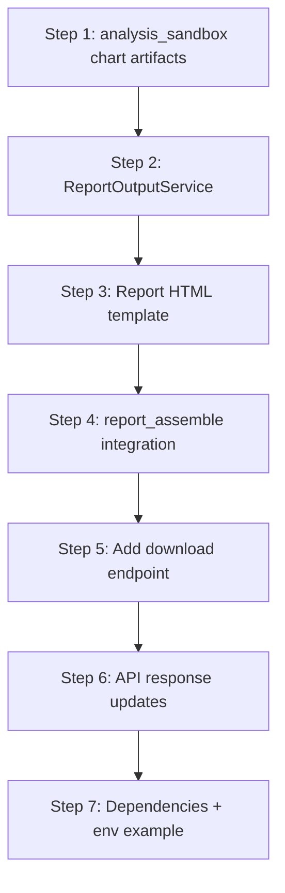

# Report Output Implementation Plan

## Overview

This document summarizes the current report output state in the LangGraph pipeline, identifies gaps vs. the architecture, and defines an incremental plan to generate Plotly charts and save output files (PDF, Plotly HTML, CSV, Parquet, JSON). It also adds a FastAPI download endpoint at `/api/v1/reports/{report_id}/{filename}` for file serving.

---

## 1. Current State Summary (validated against code)

### 1.1 Graph nodes

- [`analysis_sandbox()`](src/r2-db2/graph/nodes.py:257) analyzes results and returns:
  - `analysis_summary` (text)
  - `analysis_artifacts` list (analysis payload)
- [`report_assemble()`](src/r2-db2/graph/nodes.py:314) builds an in-memory `report` dict and returns it in state; **no files are written**.
- [`final_response()`](src/r2-db2/graph/nodes.py:338) renders Markdown response only; **no output file paths** are referenced.

### 1.2 Graph state

[`AnalyticalAgentState`](src/r2-db2/graph/state.py:11) already includes:

- `analysis_summary`
- `output_formats`
- `output_files`
- `report`

So **no state schema changes are required** for these fields.

### 1.3 Settings

[`ReportSettings`](src/r2-db2/config/settings.py:78) already exists with:

- `output_dir` (default `reports`)
- `default_formats` (default `pdf`, `plotly_html`, `csv`, `json`)
- PDF layout controls + chart size limits

So **no new settings class is needed**, but the plan must ensure nodes use these settings.

### 1.4 Plotly chart generation

[`PlotlyChartGenerator`](src/r2-db2/integrations/plotly/chart_generator.py:26) already provides:

- `generate_chart()` → dict for UI
- `generate_figure()` → `go.Figure`
- `save_html()` and `save_image()`

So **file saving primitives already exist**; the graph nodes just need to use them.

### 1.5 Run SQL tool (CSV export)

[`RunSqlTool`](src/r2-db2/tools/run_sql.py:18) already writes CSV to a tool-level `FileSystem` (conversation-scoped). This is **separate from the report output directory** and not used by the LangGraph pipeline.

### 1.6 FastAPI routes

- Graph API is mounted in [`create_app()`](src/r2-db2/main.py:72) under `/api/v1` via [`graph_routes`](src/r2-db2/servers/fastapi/graph_routes.py:1).
- There is **no report download endpoint**.

### 1.7 Dependencies

[`pyproject.toml`](pyproject.toml) already includes:

- `plotly`, `pandas`, `weasyprint`

Missing for Parquet:

- `pyarrow` (or `fastparquet`), required for `df.to_parquet()`.

Optional for PDF chart images:

- `kaleido` (Plotly static image export).

---

## 2. Gaps vs. Architecture

| Capability | Architecture Promise | Current State | Gap |
|---|---|---|---|
| Plotly HTML output | Interactive HTML per chart | Plotly supports HTML save, not wired | Wire `analysis_sandbox`/`report_assemble` to use `PlotlyChartGenerator.save_html()` |
| PDF report | PDF combining narrative + charts | No PDF generation in graph | Implement PDF generation in report output service |
| CSV export | Query results as CSV | No graph-level export | Save CSV in report output directory |
| Parquet export | Query results as Parquet | Not implemented | Add Parquet save + dependency |
| JSON summary | Structured JSON of report | Not implemented | Serialize report dict to JSON file |
| File paths in API | Output paths exposed | Not returned | Add output_files to response + download endpoint |

---

## 3. Target Architecture for Report Output

### 3.1 Flow diagram



### 3.2 Responsibilities

- **`analysis_sandbox`**: generate analysis summary + chart figure(s) (Plotly `go.Figure`) from query result data.
- **`ReportOutputService`**: centralized file I/O to `ReportSettings.output_dir`.
- **`report_assemble`**: build report dict, call output service, store `output_files` in state and report.
- **FastAPI**: provide `/api/v1/reports/{report_id}/{filename}` download endpoint.

---

## 4. Implementation Steps (ordered)

### Step 1 — Enhance `analysis_sandbox` to generate Plotly chart figures

**Files:** [`src/r2-db2/graph/nodes.py`](src/r2-db2/graph/nodes.py)

- Convert `query_result` to `pd.DataFrame`.
- Instantiate `PlotlyChartGenerator` and call `generate_figure()`.
- Store figure(s) in `analysis_artifacts` with a new type, e.g.:

```python
{
    "type": "plotly_figure",
    "title": "...",
    "figure": fig
}
```

**Design note:** The figure is not JSON-serializable; ensure it stays in in-memory state only (no persistence). If graph checkpoints serialize state, store JSON dict instead and rehydrate using `plotly.io.from_json()` in `report_assemble`.

### Step 2 — Create `ReportOutputService`

**New file:** [`src/r2-db2/services/report_output.py`](src/r2-db2/services/report_output.py)

Responsibilities:

- Create `output_dir / report_id` directories
- Save:
  - CSV (`data.csv`)
  - Parquet (`data.parquet`)
  - Plotly HTML (`chart_0.html`, ...)
  - JSON summary (`summary.json`)
  - PDF (`report.pdf`)

Recommended API:

```python
class ReportOutputService:
    def __init__(self, output_dir: Path):
        ...
    def save_csv(self, df: pd.DataFrame, report_id: str) -> Path: ...
    def save_parquet(self, df: pd.DataFrame, report_id: str) -> Path: ...
    def save_chart_html(self, fig: "go.Figure", report_id: str, index: int) -> Path: ...
    def save_json_summary(self, report: dict[str, Any], report_id: str) -> Path: ...
    def save_pdf(self, html: str, report_id: str) -> Path: ...
```

### Step 3 — Build HTML report template for PDF

**New file:** [`src/r2-db2/services/report_template.py`](src/r2-db2/services/report_template.py)

- Build an HTML string from `report` + chart image paths (optional).
- Use CSS for headings, summary, SQL block, and data preview table.

### Step 4 — Enhance `report_assemble` to save files

**Files:** [`src/r2-db2/graph/nodes.py`](src/r2-db2/graph/nodes.py)

Logic additions:

1. Read `settings.report.output_dir` and `default_formats`.
2. Build `pd.DataFrame` from `query_result`.
3. Use `ReportOutputService` to save formats:
   - `csv`, `parquet`, `json`, `plotly_html`, `pdf`.
4. Collect `output_files` and attach to report + state.

**Output format selection:**

- If `state.output_formats` is set, use it.
- Else fall back to `settings.report.default_formats`.

### Step 5 — Add API download endpoint

**Files:** [`src/r2-db2/servers/fastapi/graph_routes.py`](src/r2-db2/servers/fastapi/graph_routes.py)

Add:

```
GET /api/v1/reports/{report_id}/{filename}
```

Implementation details:

- Use `settings.report.output_dir` and `pathlib.Path` to build full path.
- Validate `report_id` and `filename` to prevent traversal.
- Return `FileResponse` with correct media type.

### Step 6 — Wire output files into API responses

**Files:** [`src/r2-db2/servers/fastapi/graph_routes.py`](src/r2-db2/servers/fastapi/graph_routes.py)

- Extend `AnalyzeResponse` to include `output_files` or embed under `report.output_files`.
- Ensure `report_assemble` returns `output_files` in state and report dict.

---

## 5. File-by-File Changes

### New files

- [`src/r2-db2/services/__init__.py`](src/r2-db2/services/__init__.py)
- [`src/r2-db2/services/report_output.py`](src/r2-db2/services/report_output.py)
- [`src/r2-db2/services/report_template.py`](src/r2-db2/services/report_template.py)

### Modified files

- [`src/r2-db2/graph/nodes.py`](src/r2-db2/graph/nodes.py)
  - `analysis_sandbox()` adds Plotly chart figures to artifacts
  - `report_assemble()` calls output service and saves files
  - `final_response()` includes output file references
- [`src/r2-db2/servers/fastapi/graph_routes.py`](src/r2-db2/servers/fastapi/graph_routes.py)
  - Add download endpoint
  - Extend response model to return output files
- [`pyproject.toml`](pyproject.toml)
  - Add `pyarrow` to core deps
  - Add optional `kaleido` under `[project.optional-dependencies]`
- [`.env.example`](.env.example)
  - Add `REPORT__OUTPUT_DIR` and `REPORT__DEFAULT_FORMATS` entries

---

## 6. Dependency Updates

Add to [`pyproject.toml`](pyproject.toml):

```toml
"pyarrow>=14.0"
```

Optional:

```toml
[project.optional-dependencies]
report = ["kaleido>=0.2.1"]
```

---

## 7. API Output Contract (Graph)

Recommended response shape from `/api/v1/analyze` and `/api/v1/approve`:

```json
{
  "report": {
    "id": "...",
    "output_files": {
      "csv": "reports/<id>/data.csv",
      "parquet": "reports/<id>/data.parquet",
      "plotly_html": ["reports/<id>/chart_0.html"],
      "json": "reports/<id>/summary.json",
      "pdf": "reports/<id>/report.pdf"
    }
  },
  "output_files": { ... }
}
```

---

## 8. Implementation Order



---

## 9. Notes & Risks

- **State serialization:** `go.Figure` objects may not be serializable by checkpointers. If needed, store Plotly JSON and rehydrate in `report_assemble` using `plotly.io.from_json()`.
- **PDF charts:** WeasyPrint cannot render interactive Plotly HTML. Use `kaleido` to export PNGs for PDF embedding; otherwise include text links to chart HTML.
- **File cleanup:** Out of scope; consider TTL cleanup later.

---

## 10. Checklist for Code Mode

- [ ] Implement `ReportOutputService` and HTML template
- [ ] Enhance `analysis_sandbox` and `report_assemble`
- [ ] Add report download endpoint in [`graph_routes`](src/r2-db2/servers/fastapi/graph_routes.py)
- [ ] Update API response schema to include `output_files`
- [ ] Add dependencies (`pyarrow`, optional `kaleido`)
- [ ] Update `.env.example`
